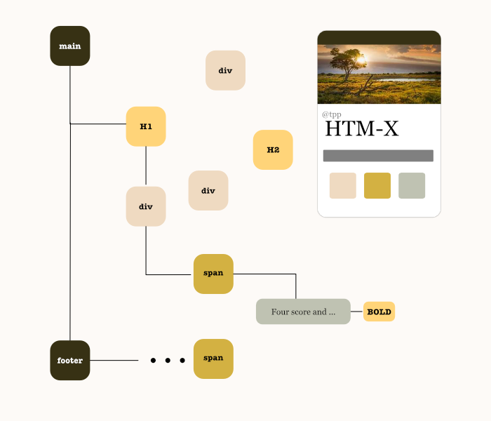

# HTML-X

Simple and Clean HTML node generator.



## Usage

`htm-x` is a simple wrapper around [`createElement()`](https://developer.mozilla.org/en-US/docs/Web/API/Document/createElement) that makes it easier to use in one simple step:

```javascript
div("Text inside div")
```

This is especially helpful when we want to embed content cleanly:

```javascript
div([
  h('img', { src: "test.png"}),
  "Text Content"
])
```

We can also add classes, styles, and any other attributes:

```javascript
div({
  classes: "class1 class2",
  style: { color: "blue" }
}, "Content can be text, children, or just a single child")
```

Besides `div()`’s we can create any other types we want:

```javascript
const { div, h, x } = require('@tpp/htm-x')

h('a', { href: "www.abc.com"}, "ABC")
h('span', {
  classes: "big small",
  style: { color: "red" },
  onclick: (e) => ...,
}, "Click me too")
```

Helpfully we can also create our own custom tag functions that can hold components applicable to our project:

```javascript
const span = x('span')
span("content")
span({style: { color: "blue" }}, "content")

const bigText = x('span', {
  classes: "big black",
  style: { color: "green" }
})
bigText("Green is Good")
bigText({style: { color: "red" }}, "But Red is better")
```

Being functional, custom tags are also composable so you can do nice things like:

```javascript
const ul = x('ul', { classes: "my-component"})
const li = x('li', { onclick: e => alert(e.target.innerText) })
const myComponent = (items) => {
  return ul(items.map(li))
}
myComponent(["item1", "item2", "item3"])
// ==>
//  <ul class="my-component">
//    <li>item1</li>
//    <li>item2</li>
//    <li>item3</li>
//  </ul>
```

## CSS Names

We can also use “css names” for the tags as a shortcut instead of using `classes:` and `id:` attributes:

```javascript
h("ul#id.class1.class2")
h(".class") // defaults to "div"
```

This is helpful in making the code cleaner in some cases.

---

